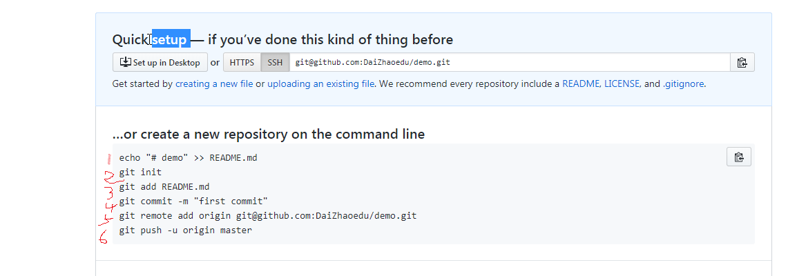
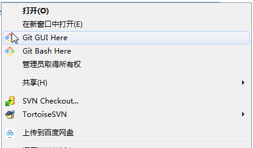
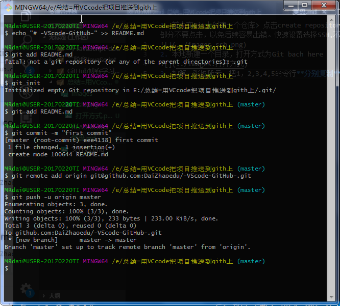
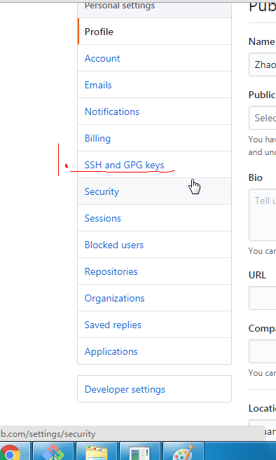
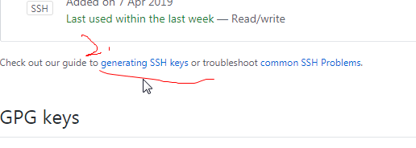
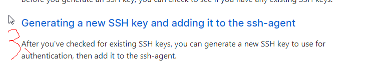
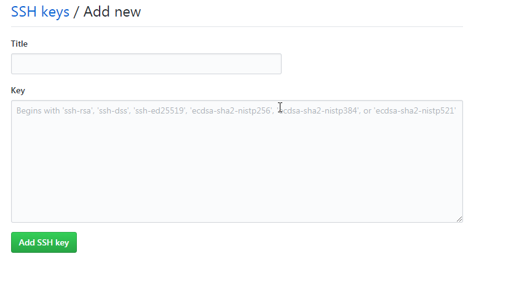
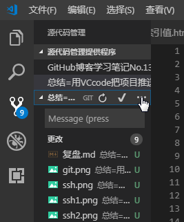

 ### Git部分
1. 首先在Git上创建一个仓库 _点击create repository_; 创建完其他部分不要点击，以免后续容易出错。快速设置选择SSH,不要设置http//；

2. 本地新建一个目录，打开方式为Git bach here(需安装Git)；

3. 如第一张图所示，把1，2,3,4,5命令行**分别复制**到git中；

4. 在Git中设置用户名和邮箱(以便其他人找到你)；
```
git config user.name "your name"
git config user.email "your email"
```
5. 这一步设置SSH(第一次需要创建，以后就不需要这步啦),如何找路径？如下图
   
考入这句命令行` ssh-keygen -t rsa -b 4096 -C "your_email@example.com"` 按三次回车键
6. 看到类似泡泡样子的命令行，再输入命令行,把生成的sshkey打印出来`cat ~/.ssh/id_rsa.pub`
7. 然后把打印出的代码拷贝到key框中，title自己填

8. 最后在Git中拷入图一第六句代码，显示[*new branch*]说明成功。
## VScode部分
1. 把建的目录放到编辑器中编辑；
2. 编辑好选择源代码管理,点击√，然后选择更多操作，点击推送
 
3. 成功与否去GitHub上刷新看看。
**前端小学生一枚，只能说出这么多，望每天都有进步鸭**
- 最近抽空熟悉熟悉Git详细操作。[git漫游指南](https://github.com/phodal/github)
   
